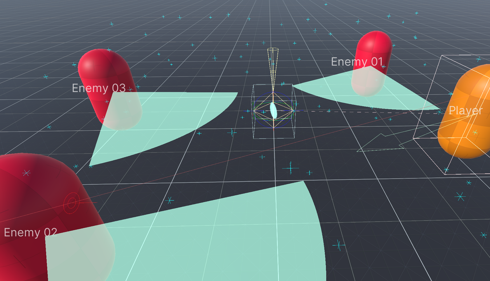

<p align="center"></p>

<br>
<p align="center">
  <a style="text-decoration:none">
    
  </a>  
  <a style="text-decoration:none">
    
  </a>
  <a style="text-decoration:none">
    
  </a>
  <a style="text-decoration:none">
    
  </a>
</p>

A set of code useful for developing Unity based games. It is independent of any architecture, so you can use it together with your favorite framework.

These are the foundations on which [Game:Work Core](https://github.com/FronkonGames/GameWork-Core) is built.

## Features 🎇

- Architecture agnostic, use it in any code.
- Many attributes to make your classes more usable in the editor (without having to write a custom Editor).
- Multiple utilities to improve your developments: checkers, debug draw, profiling and a console with custom commands.
- A lot of .Net and Unity extensions.
- The most used design patterns, in generic versions so that they are easy to adapt to your needs.
- Tested in real projects.
- Commented code with test units.

## Requisites 🔧

- Unity 2021.2 or higher.
- Test Framework 1.1.31 or higher.

## Installation ⚙️

### Editing your 'manifest.json'

- Open the manifest.json file of your Unity project.
- In the section "dependencies" add:

```c#
{
  ...
  "dependencies":
  {
    ...
    "FronkonGames.GameWork.Foundation": "git+https://github.com/FronkonGames/GameWork-Foundation.git"
  }
  ...
}
```

### Git

Just clone the repository into your Assets folder:

```c#
git clone https://github.com/FronkonGames/GameWork-Foundation.git 
```

## Use 🚀

The functionality is divided into folders, this is its structure:

```
|
|\_Runtime......................... Utilities for the game.
|   |\_Attributes.................. Attributes for fields and class properties.
|   |\_Development................. Developer utilities.
|   |   |\_Check................... Assert extension.
|   |   |\_Draw.................... Utilities for drawing gameplay information.
|   |    \_Profiling............... To find bottlenecks.
|   |\_Extensions.................. Utility extensions.
|   |   |\_System.................. C# extensions.
|   |    \_Unity................... Unity extensions.
|   |\_Math........................ Mathematical utilities.
|   |\_Patterns.................... Design patterns.
|   |   |\_Behavioral.............. Behavioural patterns.
|   |   |\_Creational.............. Creation patterns.
|   |    \_Structural.............. Structure patterns.
|    \_Unity....................... Utilities for Unity.
|       |\_MonoBehaviours.......... MonoBehaviours utilities.
|        \_Utils................... Misc.
|
 \_Editor.......................... Editor utilities.
    |\_Drawers..................... Custom attribute viewers.
     \_Inspector................... Editor appearance utilities.
```

Check the comments for each file for more information.

### Attributes

<table>
<tr><th align="left">

```c#
[Title("Attributes Demo")]
```
</th><th></th></tr>

<tr><th align="left">

```c#
[Label("Nice name")]
public string badName;
```
</th><th></th></tr>

<tr><th align="left">

```c#
[Password]
public string password;
```
</th><th></th></tr>

<tr><th align="left">

```c#
[Indent(0)]
public string noIndent;

[Indent(1)]
public string indented;
```
</th><th></th></tr>

<tr><th align="left">

```c#
[NotNull]
public GameObject cantBeNull;
```
</th><th></th></tr>

<tr><th align="left">

```c#
[File]
public string filePath;

[Folder]
public string folderPath;
```
</th><th></th></tr>

<tr><th align="left">

```c#
[Scene]
public int sceneIndex;
```
</th><th></th></tr>

<tr><th align="left">

```c#
[NotEditable]
public string notEditable;

[OnlyEditableInEditor]
public string editableInEdit;

[OnlyEditableInPlay]
public string editableInPlay;
```
</th><th></th></tr>

<tr><th align="left">

```c#
public bool toggle;

[EnableIf(nameof(toggle))]
public string enableIf;

[DisableIf(nameof(toggle))]
public string disableIf;
```
</th><th></th></tr>

<tr><th align="left">

```c#
public bool toggle;

[ShowIf(nameof(toggle))]
public string showIf;
```
</th><th></th></tr>

<tr><th align="left">

```c#
public bool toggle;

[HideIf(nameof(toggle))]
public string hideIf;
```
</th><th></th></tr>

<tr><th align="left">

```c#
[NotEditable]
public int counter;

[Button(nameof(Increase))]
public string buttonInc;

[Button(nameof(Reset))]
public string buttonReset;

public void Increase() => counter++;
public void Reset()    => counter = 0;
```
</th><th></th></tr>

</table>

### Check

Checks the values of the variables that a function receives. If the condition is not met, **an exception is thrown**. Only active when '**UNITY_ASSERTIONS**' is defined (default only in the Editor).

```c#
public void GetImpact(GameObject gameObject, float damage, Vector3 impact)
{
    Check.IsNotNull(gameObject);
    Check.IsWithin(damage, 0.0f, 100.0f);
    Check.Greater(impact, Vector3.zero);
    
    ...
}
```

Take a look at the [Check class folder](https://github.com/FronkonGames/GameWork-Foundation/tree/main/Runtime/Development/Check).

### Draw

Visualize in the Editor Scene window the useful information of your game, in a simple way and without affecting the final performance of the game.

<p align="center"></p>

```c#
// Displays the player's direction.
player.transform.Draw();

// Displays the name of the GameObject.
player.DrawName();
```

### Profiling

It measures in a simple way the time it takes for a block of code to execute, or the memory it consumes.

```c#
using (Profiling.Time("Some slow code"))
{
    ...
}
```

Output the message: "**Task 'Some slow code' took 27.66ms (0 frames)**"

```c#
using (Profiling.Memory("Some hungry code"))
{
    ...
}
```

Output the message: "**Task 'Some hungry code' consume 4.00 kb**". 

### Patterns

The most used design patterns:

- Behavioral: [Command](https://github.com/FronkonGames/GameWork-Foundation/tree/main/Runtime/Patterns/Behavioral/Command), [Observer](https://github.com/FronkonGames/GameWork-Foundation/tree/main/Runtime/Patterns/Behavioral/Observer).
- Creational: [Singleton](https://github.com/FronkonGames/GameWork-Foundation/tree/main/Runtime/Patterns/Creational/Singleton).
- Structural: [Decorator](https://github.com/FronkonGames/GameWork-Foundation/tree/main/Runtime/Patterns/Structural/Decorator).

All using generics.

## License 📜

Code released under [MIT License](https://github.com/FronkonGames/GameWork-Foundation/blob/main/LICENSE.md).

'[Prototype Textures](https://www.kenney.nl/assets/prototype-textures)' by [Kenney](https://www.kenney.nl/).  