<p align="center">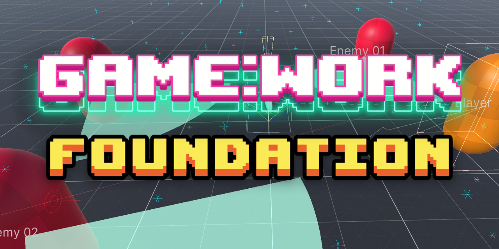</p>

<br>
<p align="center">
  <a style="text-decoration:none">
    
  </a>  
  <a style="text-decoration:none">
    
  </a>
  <a style="text-decoration:none">
    
  </a>
  <a style="text-decoration:none">
    
  </a>
</p>

A set of code useful for developing Unity based games. It is independent of any architecture, so you can use it together with your favorite framework.

These are the foundations on which [Game:Work Core](https://github.com/FronkonGames/GameWork-Core) is built.

## 🎇 Features

- Architecture agnostic, use it in any code.
- Many [attributes](./Runtime/Attributes) to make your classes more usable in the editor. Custom [Inspector](./Editor/Inspector) to help you create your own inspectors.
- Multiple utilities to improve your developments: [checkers](./Runtime/Development/Check), [debug draw](./Runtime/Development/Draw), [profiling](./Runtime/Development/Profiling) and a console with custom commands.
- A lot of .Net and Unity types [extensions](./Runtime/Extensions).
- The most used [design patterns](./Runtime/Patterns), in generic versions so that they are easy to adapt to your needs.
- [Utilities](./Runtime/Unity/Components/) to speed up prototyping time.
- Commented code with test units.

## 🔧 Requisites

- Unity 2022.3 or higher.
- Test Framework 1.1.31 or higher.

## ⚙️ Installation

### Editing your 'manifest.json'

- Open the manifest.json file of your Unity project.
- In the section "dependencies" add:

```c#
{
  ...
  "dependencies":
  {
    ...
    "FronkonGames.GameWork.Foundation": "git+https://github.com/FronkonGames/GameWork-Foundation.git"
  }
  ...
}
```

### Git

Just clone the repository into your Assets folder:

```c#
git clone https://github.com/FronkonGames/GameWork-Foundation.git 
```

### Zip

Download the [latest release](https://github.com/FronkonGames/GameWork-Foundation/releases) and unzip it into the Assets directory.

## 🚀 Use

The functionality is divided into folders, this is its structure:

```
|
|\_Runtime......................... Utilities for the game.
|   |\_Algorithms.................. Algorithms.
|   |    \_Structures.............. Data structures.
|   |\_Attributes.................. Attributes for fields and class properties.
|   |\_Development................. Developer utilities.
|   |   |\_Check................... Assert extension.
|   |   |\_Console................. Development console.
|   |   |\_Draw.................... Utilities for drawing gameplay information.
|   |    \_Profiling............... To find bottlenecks.
|   |\_Extensions.................. Utility extensions.
|   |   |\_System.................. C# extensions.
|   |    \_Unity................... Unity extensions.
|   |\_Math........................ Mathematical utilities.
|   |\_Patterns.................... Design patterns.
|   |   |\_Behavioral.............. Behavioural patterns.
|   |   |\_Creational.............. Creation patterns.
|   |    \_Structural.............. Structure patterns.
|    \_Unity....................... Utilities for Unity.
|       |\_Components.............. Useful components.
|        \_Utils................... Misc.
|
 \_Editor.......................... Editor utilities.
    |\_Drawers..................... Custom attribute viewers.
     \_Inspector................... Editor appearance utilities.
```

Check the comments for each file for more information.

### Attributes

<table>
<tr><th align="left">

```c#
[Title("Attributes Demo")]
```
</th><th>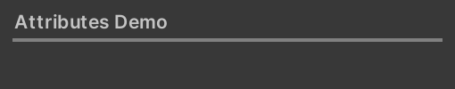</th></tr><tr><th align="left">

```c#
[MessageBox("MessageBox test", MessageType.Info)]
```
</th><th>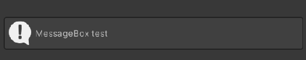</th></tr><tr><th align="left">

```c#
[Label("Int field")]
[Field(50)]
public int intField;

[Label("Int less than 0")]
[FieldLess(0, -1)]
public int intLess = -1;

[Label("Int less equal than 0")]
[FieldLessEqual(0, 0)]
public int intLessEqual;

[Label("Int greater than 0")]
[FieldGreat(0, 10)]
public int intGreater;

[Label("Int greater equal than 10")]
[FieldGreat(10, 10)]
public int intGreaterEqual;

[Label("Int")]
[Slider(0, 10, 10)]
public int intSlider;

[Label("Int snap 10")]
[Slider(0, 100, 50, 10)]
public int intSnap;

[Label("Ints min/max")]
[MinMaxSlider(0, 100, 0, 100)]
public int intMin = 0;

[HideInInspector]
public int intMax = 100;

[Label("Float field")]
[Field(1.0f)]
public float floatField;

[Label("Float less than 0")]
[FieldLess(0.0f, -1.0f)]
public float floatLess = 1.0f;

[Label("Float less equal than 0")]
[FieldLessEqual(0.0f, 0.0f)]
public float floatLessEqual;

[Label("Float greater than 0")]
[FieldGreat(0.0f, 1.0f)]
public float floatGreater;

[Label("Float greater equal than 0")]
[FieldGreatEqual(0.0f, 0.0f)]
public float floatGreaterEqual;

[Label("Float")]
[Slider(0.0f, 1.0f, 1.0f)]
public float floatSlider;

[Label("Float snap 0.5")]
[Slider(0.0f, 1.0f, 0.5f, 0.1f)]
public float floatSnap;

[Label("Floats min/max")]
[MinMaxSlider(0.0f, 1.0f)]
public float floatMin = 0.0f;

[HideInInspector]
public float floatMax = 1.0f;
```
</th><th>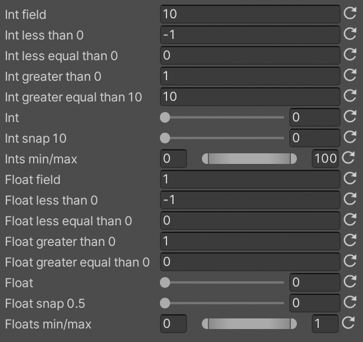</th></tr><tr><th align="left">

```c#
[Label("Nice name")]
public string badName;
```
</th><th>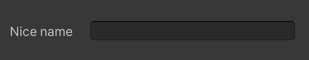</th></tr><tr><th align="left">

```c#
[Password]
public string password;
```
</th><th>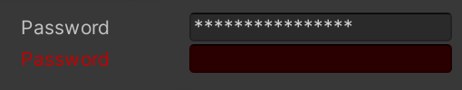</th></tr><tr><th align="left">

```c#
[Indent(0)]
public string noIndent;

[Indent(1)]
public string indented;
```
</th><th>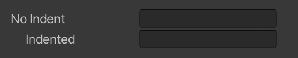</th></tr><tr><th align="left">

```c#
[NotNull]
public GameObject cantBeNull;
```
</th><th>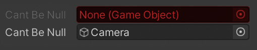</th></tr><tr><th align="left">

```c#
[File]
public string filePath;

[Folder]
public string folderPath;
```
</th><th>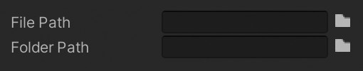</th></tr><tr><th align="left">

```c#
[Scene]
public int sceneIndex;
```
</th><th>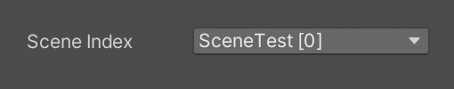</th></tr><tr><th align="left">

```c#
[NotEditable]
public string notEditable;

[OnlyEditableInEditor]
public string editableInEdit;

[OnlyEditableInPlay]
public string editableInPlay;
```
</th><th>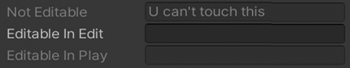</th></tr><tr><th align="left">

```c#
public bool toggle;

[EnableIf(nameof(toggle))]
public string enableIf;

[DisableIf(nameof(toggle))]
public string disableIf;
```
</th><th>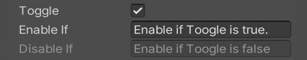</th></tr><tr><th align="left">

```c#
public bool toggle;

[ShowIf(nameof(toggle))]
public string showIf;
```
</th><th>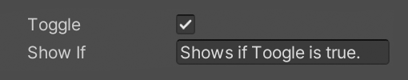</th></tr><tr><th align="left">

```c#
public bool toggle;

[HideIf(nameof(toggle))]
public string hideIf;
```
</th><th>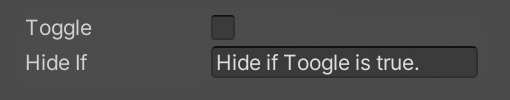</th></tr><tr><th align="left">

```c#
[KeyCode]
public KeyCode keyCode;
```
</th><th>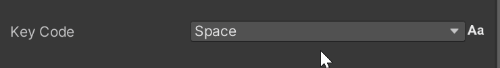</th></tr><tr><th align="left">

```c#
[NotEditable]
public int counter;

[Button(nameof(Increase))]
public string buttonInc;

[Button(nameof(Reset))]
public string buttonReset;

public void Increase() => counter++;
public void Reset()    => counter = 0;
```
</th><th>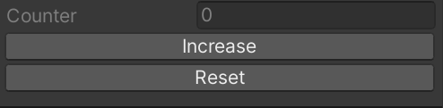</th></tr>

</table>

### Custom Inspector

A simple way to create your own inspectors by quickly accessing all the private fields of your components.

<p align="center">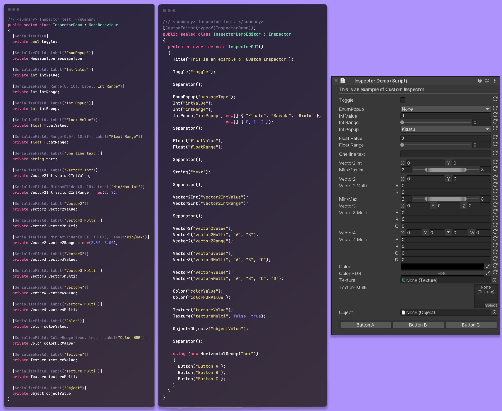</p>

### Check

Checks the values of the variables that a function receives. If the condition is not met, **an exception is thrown**. Only active when '**UNITY_ASSERTIONS**' is defined (default only in the Editor).

```c#
public void GetImpact(GameObject gameObject, float damage, Vector3 impact)
{
    Check.IsNotNull(gameObject);
    Check.IsWithin(damage, 0.0f, 100.0f);
    Check.Greater(impact, Vector3.zero);
    
    ...
}
```

Take a look at the [Check class folder](./Runtime/Development/Check).

### Draw

Visualize in the Editor Scene window useful information of your game, in a simple way and without affecting the final performance of the game.

<p align="center"></p>

```c#
// Displays an array of points.
points.Draw();

// Displays the player's direction.
player.transform.Draw();

// Displays the name of the GameObject.
player.DrawName();

// Displays RaycastHits.
int hits = Physics.RaycastNonAlloc(playerRay, playerHits, 100.0f);
if (hits > 0)
  playerHits.Draw(playerRay);
```

### Components

Useful components to support the development of prototypes:

<p align="center">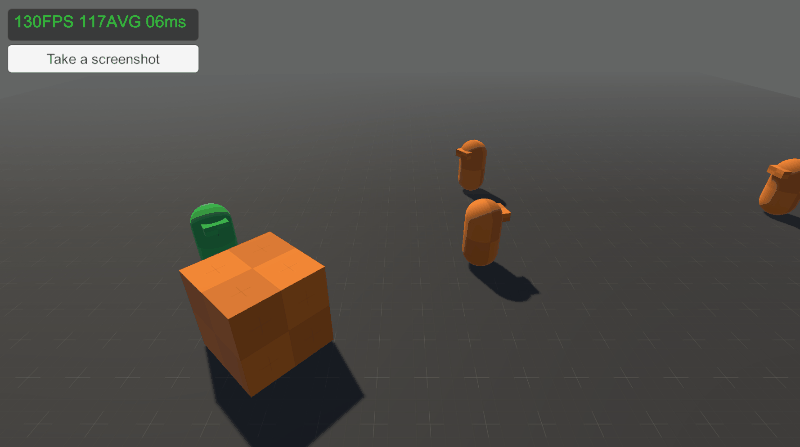</p>

* [Free Camera](./Runtime/Unity/Components/FreeCamera.cs): a simple free camera.
* [Screenshooter](./Runtime/Unity/Components/Screenshooter.cs): asynchronous screen capture.
* [FPS Counter](./Runtime/Unity/Components/FPSCounter.cs): calculates the SPF and displays it.
* [Collision Test](./Runtime/Unity/Components/CollisionTest.cs): triggers events when collisions are detected.
* [Trigger Test](./Runtime/Unity/Components/TriggerTest.cs): triggers events.
* [Face To](./Runtime/Unity/Components/FaceTo.cs): orients the object so that it faces a target.
* [Follower](./Runtime/Unity/Components/Follower.cs): follow a target.
* [Mover](./Runtime/Unity/Components/Mover.cs): moves object linearly.
* [Rotator](./Runtime/Unity/Components/Rotator.cs): rotates an object.

### Development Console

A developer console for executing commands.

<p align="center">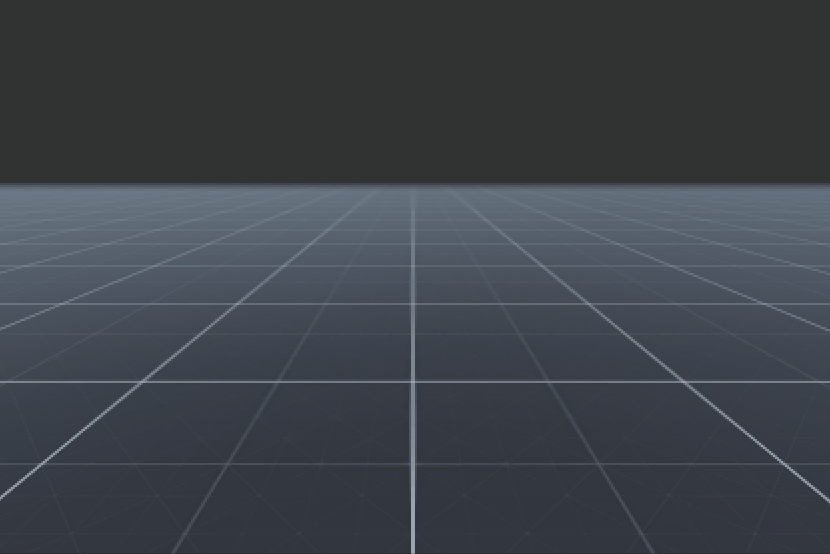</p>

Simply add a GameObject with the [DevelopmentConsole](./Runtime/Development/Console/DevelopmentConsole.cs) component and assign the commands you want to use to it.

Commands are ScriptableObjects that you can create from [DevelopmentCommand](./Runtime/Development/Console/DevelopmentCommand.cs).
See the commands included in [this folder](./Runtime/Development/Console/Commands/).

```c#
/// <summary>
/// Quit application.
/// </summary>
[CreateAssetMenu(fileName = "Quit", menuName = "Game:Work/Development/Command/Quit")]
public class QuitCommand : DevelopmentCommand
{
    public QuitCommand()
    {
      Id = "quit";
      Usage = "quit";
      Description = "Quit application.";
    }

    public override bool Execute(string[] args)
    {
        Application.Quit();
    
        return true;
    }
}
```

### Profiling

It measures in a simple way the time it takes for a block of code to execute, or the memory it consumes.

```c#
using (Profiling.Time("Some slow code"))
{
    ...
}
```

Output the message: "**Task 'Some slow code' took 27.66ms (0 frames)**"

```c#
using (Profiling.Memory("Some hungry code"))
{
    ...
}
```

Output the message: "**Task 'Some hungry code' consume 4.00 kb**". 

### Algorithms

Algorithms and data structures.

- Structures: [ArrayList](./Runtime/Algorithms/Structures/ArrayList.cs).

### Patterns

The most used design patterns:

- Behavioral: [Command](./Runtime/Patterns/Behavioral/Command), [Observer](./Runtime/Patterns/Behavioral/Observer), [Strategy](./Runtime/Patterns/Behavioral/Strategy), [Visitor](./Runtime/Patterns/Behavioral/Visitor).
- Creational: [Singleton](./Runtime/Patterns/Creational/Singleton).
- Structural: [Decorator](./Runtime/Patterns/Structural/Decorator).

All using generics.

### Unit tests

<p align="center">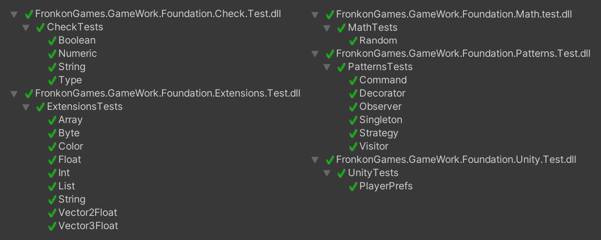</p>

## 📜 License

Code released under [MIT License](https://github.com/FronkonGames/GameWork-Foundation/blob/main/LICENSE.md).

'[Prototype Textures](https://www.kenney.nl/assets/prototype-textures)' by [Kenney](https://www.kenney.nl/).  