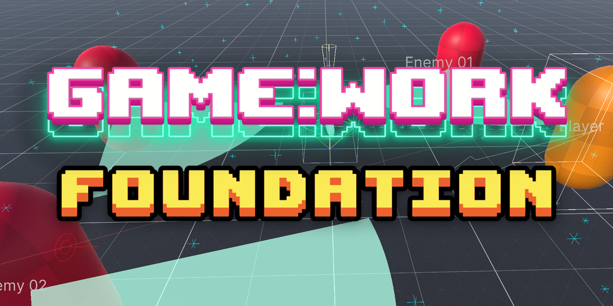

<p align="center"></p>

<br>
<p align="center">
  <a style="text-decoration:none">
    
  </a>  
  <a style="text-decoration:none">
    
  </a>
  <a style="text-decoration:none">
    
  </a>
  <a style="text-decoration:none">
    
  </a>
</p>

A set of code useful for developing Unity based games. It is independent of any architecture, so you can use it together with your favorite framework.

These are the foundations on which [Game:Work Core](https://github.com/FronkonGames/GameWork-Core) is built.

## 🎇 Features

- Architecture agnostic, use it in any code.
- Many [attributes](./Runtime/Attributes) to make your classes more usable in the editor. Custom [Inspector](./Editor/Inspector) to help you create your own inspectors.
- Multiple utilities to improve your developments: [checkers](./Runtime/Development/Check), [debug draw](./Runtime/Development/Draw), [profiling](./Runtime/Development/Profiling) and a console with custom commands.
- A lot of .Net and Unity types [extensions](./Runtime/Extensions) (System, Unity, functional, enum, collider, texture, animator, MonoBehaviour, and more).
- The most used design patterns (15 patterns), in generic versions so that they are easy to adapt to your needs.
- [Data Holders](./Runtime/Data/Holders) system with typed ScriptableObject holders and generic Option class for local/global value configuration.
- [Utilities](./Runtime/Development/Prototype/) to speed up prototyping time.
- Commented code with test units.

## 🔧 Requisites

- Unity 6000.0 or higher.
- Universal RP 14.0.11 or higher.
- Test Framework 1.1.31 or higher.

## ⚙️ Installation

### Editing your 'manifest.json'

- Open the manifest.json file of your Unity project.
- In the section "dependencies" add:

```c#
{
  ...
  "dependencies":
  {
    ...
    "FronkonGames.GameWork.Foundation": "git+https://github.com/FronkonGames/GameWork-Foundation.git"
  }
  ...
}
```

### Git

Just clone the repository into your Assets folder:

```c#
git clone https://github.com/FronkonGames/GameWork-Foundation.git 
```

### Unity Assets Store

Download the [latest release](https://assetstore.unity.com/packages/tools/game-toolkits/game-work-foundation-383792?aid=1101l9zFC&utm_source=aff) and install.

## 🚀 Use

The functionality is divided into folders, this is its structure:

```
|
|\_Runtime......................... Utilities for the game.
|   |\_Algorithms.................. Algorithms.
|   |    \_Structures.............. Data structures.
|   |\_Attributes.................. Attributes for fields and class properties.
|   |\_Components.................. Components.
|   |\_Data......................... Data utilities.
|   |   |\_Holders.................. ScriptableObject value holders.
|   |    \_Serialization............ Serializable types for Unity (DateTime, Time, Dictionary).
|   |\_Development................. Developer utilities.
|   |   |\_Check................... Assert extension.
|   |   |\_Console................. Development console.
|   |   |\_Draw.................... Utilities for drawing gameplay information.
|   |   |\_Profiling............... To find bottlenecks.
|   |    \_Prototype............... Useful components for prototypes.
|   |\_Extensions.................. Utility extensions.
|   |   |\_System.................. C# extensions.
|   |    \_Unity................... Unity extensions.
|   |\_Math........................ Mathematical utilities.
|   |\_Patterns.................... Design patterns.
|   |   |\_Behavioral.............. Behavioural patterns.
|   |   |\_Creational.............. Creation patterns.
|   |   |\_Structural.............. Structure patterns.
|   |    \_Optimization............ Optimization patterns.
|    \_Utils....................... Utilities.
|
|\_Editor.......................... Editor utilities.
|   |\_Drawers..................... Custom attribute viewers.
|   |\_Fonts....................... Font for debug.
|   |\_Inspector................... Editor appearance utilities.
|    \_Tools....................... Editor tools (screenshots, etc.).
|
|\_Settings........................ Project settings.
|\_Demos........................... Demo scenes.
|\_Media........................... Misc resources.
 \_Test............................ Unit tests code.

```

Check the comments for each file for more information.

### Documentation

#### Runtime

| Topic | Documentation |
|---|---|
| Attributes | [Runtime/Attributes/README.md](./Runtime/Attributes/README.md) |
| Check | [Runtime/Development/Check/README.md](./Runtime/Development/Check/README.md) |
| Draw | [Runtime/Development/Draw/README.md](./Runtime/Development/Draw/README.md) |
| Prototype | [Runtime/Development/Prototype/README.md](./Runtime/Development/Prototype/README.md) |
| Development Console | [Runtime/Development/Console/README.md](./Runtime/Development/Console/README.md) |
| Profiling | [Runtime/Development/Profiling/README.md](./Runtime/Development/Profiling/README.md) |
| Algorithms | [Runtime/Algorithms/README.md](./Runtime/Algorithms/README.md) |
| Math | [Runtime/Math/README.md](./Runtime/Math/README.md) |
| Utils | [Runtime/Utils/README.md](./Runtime/Utils/README.md) |
| Behavioral patterns | [Runtime/Patterns/Behavioral/README.md](./Runtime/Patterns/Behavioral/README.md) |
| Creational patterns | [Runtime/Patterns/Creational/README.md](./Runtime/Patterns/Creational/README.md) |
| Structural patterns | [Runtime/Patterns/Structural/README.md](./Runtime/Patterns/Structural/README.md) |
| Optimization patterns | [Runtime/Patterns/Optimization/README.md](./Runtime/Patterns/Optimization/README.md) |
| Data Holders | [Runtime/Data/Holders/README.md](./Runtime/Data/Holders/README.md) |
| Serialization | [Runtime/Data/Serialization/README.md](./Runtime/Data/Serialization/README.md) |
| System extensions | [Runtime/Extensions/System/README.md](./Runtime/Extensions/System/README.md) |
| Unity extensions | [Runtime/Extensions/Unity/README.md](./Runtime/Extensions/Unity/README.md) |

#### Editor

| Topic | Documentation |
|---|---|
| Custom Inspector | [Editor/Inspector/README.md](./Editor/Inspector/README.md) |
| Property Drawers | [Editor/Drawers/README.md](./Editor/Drawers/README.md) |

#### Tools

| Topic | Documentation |
|---|---|
| Editor Tools | [Editor/Tools/README.md](./Editor/Tools/README.md) |

#### Tests

| Topic | Documentation |
|---|---|
| Unit tests | [Test/README.md](./Test/README.md) |

## 📜 License

Code released under [MIT License](https://github.com/FronkonGames/GameWork-Foundation/blob/main/LICENSE.md).

'[Prototype Asset Pack](https://assethunts.itch.io/prototype)' by [AssetHunts](https://assethunts.itch.io/).

'[Prototype Textures](https://www.kenney.nl/assets/prototype-textures)' and '[Mannequin Character Pack](https://assethunts.itch.io/mannequinfree)' by [AssetHunts](https://assethunts.itch.io/).
