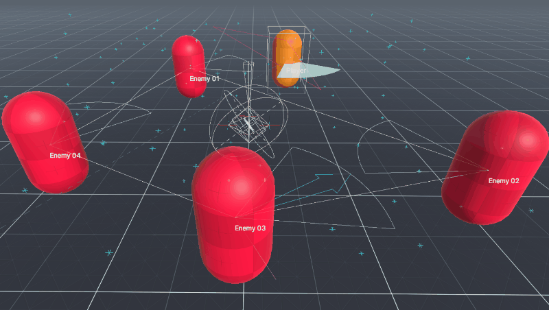

# Draw

Visualize in the Editor Scene window useful information of your game, in a simple way and without affecting the final performance of the game.

<p align="center"></p>

```c#
// Displays an array of points.
points.Draw();

// Displays the player's direction.
player.transform.Draw();

// Displays the name of the GameObject.
player.DrawName();

// Displays RaycastHits.
int hits = Physics.RaycastNonAlloc(playerRay, playerHits, 100.0f);
if (hits > 0)
  playerHits.Draw(playerRay);
```
